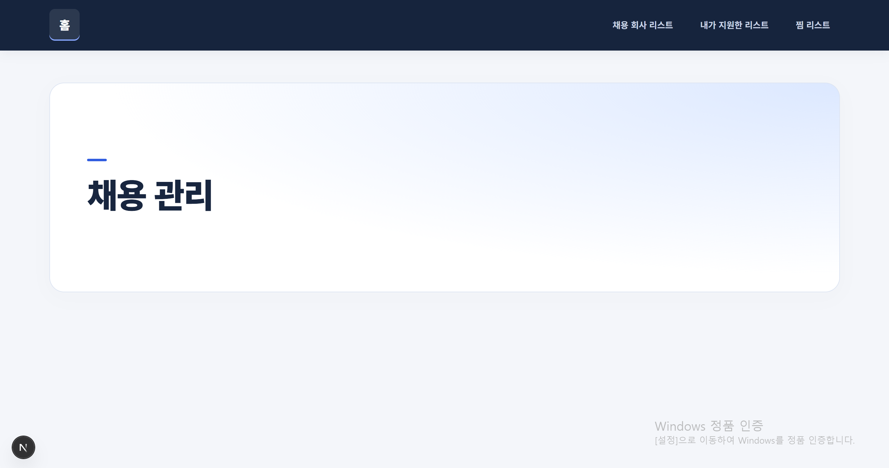
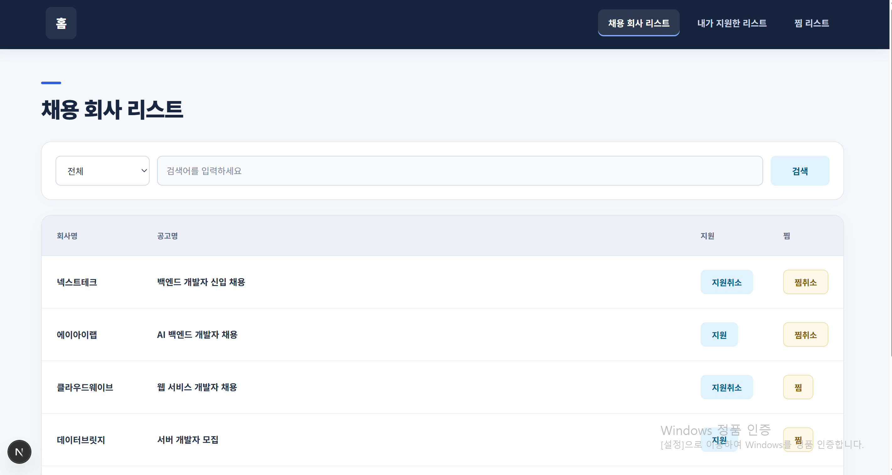
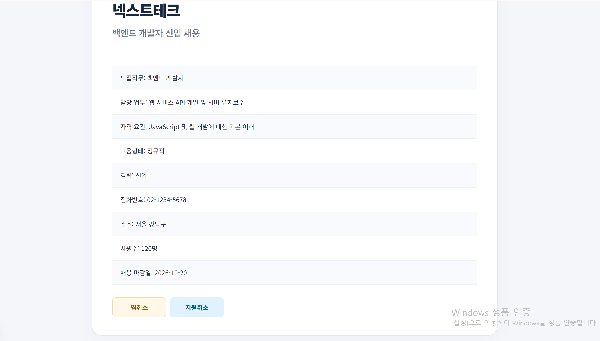
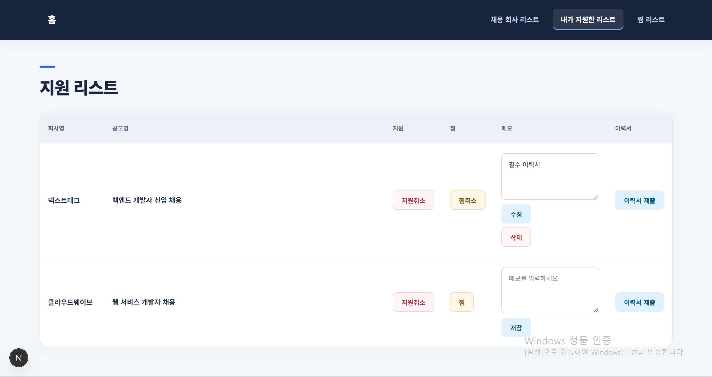
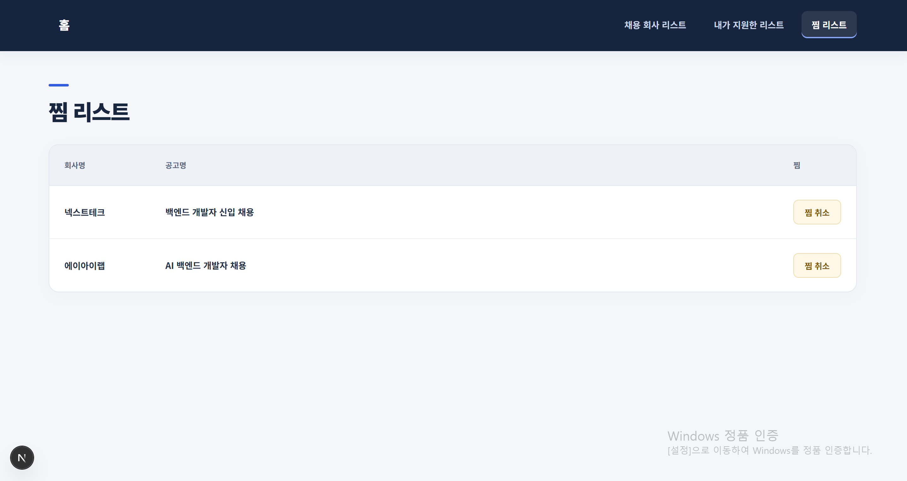

# 취업 지원 관리 (Job Application Manager)

## 1. 프로젝트 소개

채용공고를 조회하고 검색하여 관심 있는 공고를 찜하거나 지원하고, 지원한 공고의 이력서 제출과 메모를 관리할 수 있는 Next.js 기반 개인 프로젝트입니다.

- 프로젝트 이름: 취업 지원 관리 (Job Application Manager)
- 프로젝트 주제: 구직자를 위한 채용공고 및 지원 현황 관리 서비스
- 개발 기간: 2026.09 ~ 2026.10
- 주요 사용자: 여러 채용공고를 확인하면서 지원 현황과 관심 공고를 한곳에서 관리하고 싶은 구직자
- 제작 목적: 여러 채용공고의 정보와 지원 여부를 한곳에서 확인하고, 지원·찜·이력서·메모 등 취업 지원 과정에서 필요한 정보를 편리하게 관리할 수 있도록 제작했습니다.

---

## 2. 주요 기능

- 전체 채용공고 목록을 조회할 수 있습니다.
- 전체, 회사명, 공고명, 경력, 고용형태, 지역, 모집직무를 기준으로 채용공고를 검색할 수 있습니다.
- 공고명을 선택하면 해당 채용공고의 상세 정보를 확인할 수 있습니다.
- 원하는 채용공고에 지원하거나 이미 지원한 공고의 지원을 취소할 수 있습니다.
- 관심 있는 채용공고를 찜하거나 찜을 취소할 수 있습니다.
- 지원한 채용공고만 모아서 지원 내역을 확인할 수 있습니다.
- 찜한 채용공고만 모아서 찜 목록을 확인할 수 있습니다.
- 지원한 채용공고에 이력서를 제출하거나 제출을 취소할 수 있습니다.
- 이력서 제출 전 확인창을 통해 제출 여부를 다시 확인할 수 있습니다.
- 지원한 채용공고에 메모를 작성하고 기존 메모를 수정하거나 삭제할 수 있습니다.
- 검색 결과나 지원·찜 내역이 없을 경우 빈 상태 화면을 표시합니다.

| 기능 | 주소 | 설명 |
| --- | --- | --- |
| 메인 | `/` | 취업 지원 관리 서비스의 메인 화면을 표시합니다. |
| 채용공고 목록 및 검색 | `/companyList` | 전체 채용공고를 조회하고 원하는 조건으로 검색합니다. |
| 채용공고 상세 | `/companyList/[id]` | 선택한 채용공고의 상세 정보를 확인합니다. |
| 지원 내역 | `/applicationList` | 지원한 채용공고를 확인하고 이력서와 메모를 관리합니다. |
| 찜 목록 | `/favoriteList` | 찜한 채용공고를 확인하고 찜을 관리합니다. |

---

## 3. 화면 구성

### 메인 화면



취업 지원 관리 서비스의 메인 화면입니다.  
채용 회사 리스트, 지원 리스트, 찜 리스트 등의 주요 페이지로 이동할 수 있습니다.

### 채용공고 목록 및 검색 화면



전체 채용공고의 회사명과 공고명을 확인할 수 있습니다.  
전체, 회사명, 공고명, 경력, 고용형태, 지역, 모집직무 중 원하는 검색 조건을 선택하여 채용공고를 검색할 수 있습니다.  
각 채용공고에서 지원·지원취소 및 찜·찜취소 기능을 사용할 수 있으며, 공고명을 선택하면 상세 화면으로 이동합니다.  
검색 결과가 없는 경우 빈 상태 이미지와 `검색 결과가 없습니다.`라는 안내 문구를 표시합니다.

### 채용공고 상세 화면



선택한 채용공고의 상세 정보를 확인할 수 있습니다.  
회사명, 공고명, 모집직무, 담당업무, 자격요건, 고용형태, 경력, 근무지역, 전화번호, 사원 수, 채용 마감일 등의 정보를 표시합니다.  
상세 화면에서도 해당 채용공고에 지원하거나 지원을 취소할 수 있으며, 찜하거나 찜을 취소할 수 있습니다.

### 지원 내역 화면



사용자가 지원한 채용공고를 모아서 확인할 수 있습니다.  
지원한 공고의 정보를 확인하고 다음 기능을 사용할 수 있습니다.

- 지원 취소
- 찜 및 찜 취소
- 이력서 제출 및 제출 취소
- 메모 작성
- 메모 수정
- 메모 삭제

### 찜 목록 화면



사용자가 찜한 채용공고만 모아서 확인할 수 있습니다.  
공고명을 선택하면 해당 채용공고의 상세 화면으로 이동할 수 있으며, 더 이상 관심이 없는 공고는 찜을 취소할 수 있습니다.

---

## 4. 기술 스택

- Next.js - App Router를 이용한 페이지 및 라우팅 구성
- React - 컴포넌트 구성 및 클라이언트 상태 관리
- JavaScript - 프로젝트 기능 및 로직 구현
- Axios - JSON Server와의 API 통신
- JSON Server - 채용공고, 지원, 찜, 이력서 제출, 메모 데이터 관리
- CSS - 화면 스타일 구성

---

## 5. 설치 및 실행 방법

### 1. 저장소 복제

```bash
git clone 저장소주소
```

### 2. 프로젝트 폴더로 이동

```bash
cd job-application-manager
```

### 3. 패키지 설치

```bash
npm install
```

### 4. JSON Server 실행

첫 번째 터미널에서 JSON Server를 실행합니다.

```bash
npx json-server db.json --port 3001
```

JSON Server는 다음 주소에서 실행됩니다.

```text
http://localhost:3001
```

주요 API 주소는 다음과 같습니다.

```text
http://localhost:3001/jobs
http://localhost:3001/applications
http://localhost:3001/favorites
http://localhost:3001/resumeSubmissions
http://localhost:3001/memos
```

### 5. Next.js 실행

새로운 터미널을 열어 Next.js 개발 서버를 실행합니다.

```bash
npm run dev
```

접속 주소

- Next.js: `http://localhost:3000`
- JSON Server: `http://localhost:3001`

JSON Server와 Next.js는 각각 실행되어야 하므로 서로 다른 터미널에서 실행합니다.

---

## 6. 폴더 구조

```text
src/
└─ app/
   ├─ applicationList/
   │  ├─ ConfirmSubmitButton.js
   │  └─ page.js
   │
   ├─ companyList/
   │  ├─ [id]/
   │  │  └─ page.js
   │  ├─ actions.js
   │  ├─ CompanyList.jsx
   │  └─ page.js
   │
   ├─ favoriteList/
   │  └─ page.js
   │
   ├─ error.js
   ├─ globals.css
   ├─ layout.js
   ├─ loading.js
   └─ page.js
```

### 주요 폴더 및 파일 역할

- `companyList/page.js`: 채용공고, 지원, 찜 데이터를 조회하여 클라이언트 컴포넌트에 전달합니다.
- `companyList/CompanyList.jsx`: 채용공고 검색과 지원·지원취소, 찜·찜취소 등 사용자 상호작용을 처리합니다.
- `companyList/[id]/page.js`: 선택한 채용공고의 상세 정보를 조회하여 표시합니다.
- `companyList/actions.js`: 지원, 찜, 이력서, 메모와 관련된 데이터 등록·수정·삭제 API 요청을 처리합니다.
- `applicationList/page.js`: 지원한 채용공고를 조회하고 이력서 및 메모 관리 기능을 제공합니다.
- `applicationList/ConfirmSubmitButton.js`: 이력서를 제출하기 전에 확인창을 표시합니다.
- `favoriteList/page.js`: 사용자가 찜한 채용공고 목록을 표시합니다.
- `layout.js`: 각 페이지로 이동할 수 있는 공통 내비게이션을 구성합니다.
- `globals.css`: 프로젝트의 공통 스타일을 관리합니다.

---

## 7. 컴포넌트 설계

### 주요 컴포넌트

| 컴포넌트 | 역할 |
| --- | --- |
| `CompanyList` | 채용공고, 지원, 찜 데이터를 서버에서 조회하여 클라이언트 컴포넌트에 전달합니다. |
| `CompanyListClient` | 채용공고 검색 결과를 표시하고 지원·지원취소, 찜·찜취소 기능을 처리합니다. |
| 채용공고 상세 페이지 | 선택한 채용공고의 상세 정보를 조회하여 표시합니다. |
| 지원 내역 페이지 | 지원한 채용공고를 표시하고 지원취소, 이력서, 메모 관련 기능을 제공합니다. |
| 찜 목록 페이지 | 사용자가 찜한 채용공고를 조회하여 표시합니다. |
| `ConfirmSubmitButton` | 이력서를 제출하기 전에 확인창을 표시하여 제출 여부를 확인합니다. |

### 상태 관리

- 채용공고 목록은 서버 컴포넌트에서 조회하여 클라이언트 컴포넌트에 props로 전달합니다.
- 지원 목록은 `useState`를 사용하여 관리합니다.
- 찜 목록은 `useState`를 사용하여 관리합니다.
- 검색 조건은 URL의 `type`, `keyword` 값을 사용합니다.
- 지원, 찜, 이력서 제출, 메모 데이터는 JSON Server에 저장합니다.
- JSON Server에 저장된 데이터는 새로고침 후 다시 조회하여 화면에 표시합니다.
- 현재 프로젝트 규모에서는 별도의 전역 상태 관리가 필요하지 않아 Zustand를 사용하지 않았습니다.
- TanStack Query도 사용하지 않고 Axios와 React의 상태 관리를 이용하여 구현했습니다.

### 컴포넌트 분리 이유

채용공고 목록에서는 서버 컴포넌트인 `companyList/page.js`에서 Axios를 사용하여 채용공고, 지원 내역, 찜 내역을 조회합니다.  
조회한 데이터는 props를 통해 클라이언트 컴포넌트인 `CompanyList.jsx`에 전달합니다.

`CompanyList.jsx`는 `'use client'`를 사용하며, 사용자가 지원이나 찜 버튼을 눌렀을 때 화면을 바로 변경해야 하므로 지원 목록과 찜 목록을 `useState`로 관리합니다.

데이터 조회와 사용자 상호작용의 역할을 나누기 위해 서버 컴포넌트와 클라이언트 컴포넌트를 분리했습니다.

---

## 8. 트러블슈팅

### JSON Server 연결 오류

#### 문제

프로젝트를 실행하는 과정에서 채용공고 데이터를 가져오지 못하고 `ECONNREFUSED` 오류가 발생했습니다.

#### 원인

Next.js에서는 다음 주소를 통해 JSON Server의 데이터를 요청하도록 작성되어 있었습니다.

```text
http://localhost:3001
```

하지만 3001번 포트에서 JSON Server가 실행되고 있지 않아 API 요청을 처리할 서버가 없는 상태였습니다.

#### 해결

별도의 터미널을 열고 다음 명령어를 실행하여 JSON Server를 3001번 포트에서 실행했습니다.

```bash
npx json-server db.json --port 3001
```

JSON Server를 실행한 후 `/jobs`, `/applications`, `/favorites` 등의 데이터를 정상적으로 조회할 수 있었습니다.

#### 알게 된 점

Next.js 개발 서버와 JSON Server는 서로 별도로 실행되는 서버이기 때문에 두 서버를 각각 실행해야 한다는 것을 알게 되었습니다.

또한 `ECONNREFUSED`와 같은 연결 오류가 발생했을 때 코드만 확인하는 것이 아니라 데이터를 제공하는 서버가 정상적으로 실행되고 있는지도 확인해야 한다는 것을 알게 되었습니다.

### 서버 컴포넌트와 클라이언트 컴포넌트 분리

#### 문제

채용공고 목록을 구현하면서 데이터를 조회하는 부분과 지원·찜처럼 사용자의 동작에 따라 화면이 변경되는 부분을 어떻게 구성해야 할지 고민했습니다.

#### 원인

채용공고 데이터는 페이지가 표시될 때 서버에서 조회하면 되지만, 지원과 찜은 사용자가 버튼을 클릭할 때마다 화면의 상태가 바로 변경되어야 했습니다.

#### 해결

`companyList/page.js`에서 Axios와 `async/await`를 사용하여 초기 데이터를 조회했습니다.

조회한 채용공고, 지원 내역, 찜 내역은 props를 통해 `CompanyList.jsx`로 전달했습니다.

`CompanyList.jsx`에는 `'use client'`를 선언하고 사용자의 동작에 따라 변경되는 지원 목록과 찜 목록을 `useState`로 관리하도록 구성했습니다.

#### 알게 된 점

모든 데이터를 클라이언트 컴포넌트에서 `useEffect`로 조회할 필요는 없으며, 서버 컴포넌트에서 필요한 초기 데이터를 먼저 조회한 후 사용자 상호작용이 필요한 부분을 클라이언트 컴포넌트로 분리할 수 있다는 것을 알게 되었습니다.

또한 변경되지 않는 데이터와 사용자 동작에 따라 변경되는 데이터를 구분하여 상태를 관리하는 방법을 이해할 수 있었습니다.

---

## 9. 프로젝트 회고

이번 프로젝트에서는 주제와 필요한 기능을 직접 정하고 구현하면서 기획부터 개발까지의 과정을 경험할 수 있었습니다. 단순히 주어진 코드를 따라 작성하는 것이 아니라 어떤 기능이 필요한지 정하고, 기능에 필요한 데이터와 화면을 직접 구성하는 과정에서 기획과 설계의 중요성을 알게 되었습니다.

채용공고 조회와 상세 페이지뿐만 아니라 검색, 지원, 찜, 이력서 제출, 메모 관리 기능을 구현하면서 하나의 데이터가 여러 화면에서 어떻게 연결되어 사용되는지 이해할 수 있었습니다.

특히 서버 컴포넌트에서 데이터를 조회하여 클라이언트 컴포넌트에 props로 전달하고, 사용자 동작에 따라 변경되는 지원과 찜 데이터는 `useState`로 관리하면서 서버 컴포넌트와 클라이언트 컴포넌트의 역할 차이를 실제 프로젝트를 통해 이해할 수 있었습니다.

또한 JSON Server를 사용하여 `GET`, `POST`, `PATCH`, `DELETE` 요청을 구현하면서 데이터를 단순히 조회하는 것뿐만 아니라 데이터를 생성하고 수정하거나 삭제한 뒤 변경된 내용을 화면에 반영하는 과정도 경험할 수 있었습니다.

프로젝트를 진행하면서 서버가 실행되지 않아 API 연결 오류가 발생하거나 컴포넌트 사이의 데이터 전달 방식을 고민하는 과정도 있었지만, 오류의 원인을 확인하고 해결하면서 문제를 찾는 방법을 배울 수 있었습니다.

추후에는 로딩 및 오류 처리 기능을 더욱 보완하고, JSON Server가 아닌 실제 백엔드 서버와 데이터베이스를 연결하여 보다 완성도 높은 서비스로 개선해 보고 싶습니다.